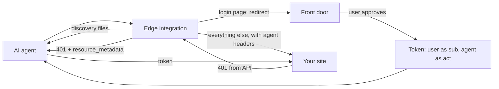
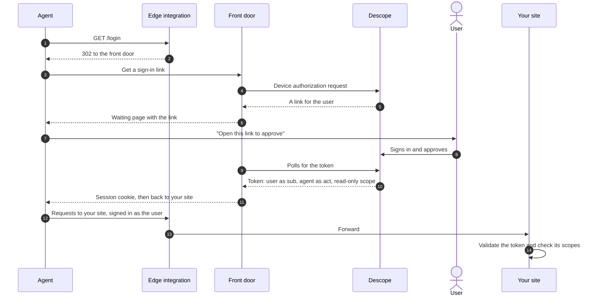

# Agent Edge

Agent Edge gives your customers' AI agents their own way into your site, with [Descope](https://www.descope.com) as the authorization server. Your site's login stays as it is.

It runs at the edge, in front of your site. It recognizes agents, shows them where to sign in, and sends them to a **front door**, where the customer approves them. It starts in monitor mode, which only logs agents, and if anything breaks, requests go to your site unchanged.

| Folder | What it is |
| --- | --- |
| [`cloudflare/`](cloudflare/) | The edge integration, a Cloudflare Worker |
| [`front-door/`](front-door/) | An example front door, deployed in front of [Northbound](https://github.com/descope-sample-apps/northbound-sample-app) |

## How it works

Today an agent that reaches a login page asks the user for their password and signs in as them, so the site can't tell the two apart. With Agent Edge, the agent asks for access instead. The user approves it on their own device, and Descope issues a token that names both the user and the agent.

For each request, the edge integration:

1. Serves `/agents` and `/.well-known/oauth-protected-resource` itself.
2. Checks whether the caller is an agent: a valid Web Bot Auth signature makes it `verified`; the front door's session cookie, Cloudflare's verified bots, or an agent-like user agent make it `unverified`.
3. In route mode, sends agents on your login page to the front door and returns a 403 on pages agents shouldn't use, such as payment methods.
4. Forwards everything else, adding `x-descope-agent` headers.
5. Adds a `resource_metadata` challenge to your API's 401s, and a visible "Using an AI assistant?" box to your login pages.

It identifies agents. It doesn't decide what they can do; your site does that with the token.

## How agents get a token

**Agents that can open a browser,** such as MCP clients, find Descope from the API's 401 and use the standard authorization code flow. They don't use the front door.

**Agents that can't,** such as computer use agents in a cloud VM, go through the front door. It gives them a sign-in link to pass to the user (the device flow). Some agents, such as Muse and Instinct, are reluctant to hand users links, so they can send the user's email instead and Descope emails the approval (CIBA). Either way the user approves on their own device.

Browser agents get the token as a cookie on your domain, so they don't need to add headers. See the [front door README](front-door/README.md) for details.

### Approving in Descope

The approval link opens a Descope flow that you configure on the inbound app. It signs the user in, then shows a consent screen with the agent, what it's asking to do, and a code to match. How users sign in is up to you:

- **Descope sign-in.** A one-time code to the same email, a magic link, or Google. Nothing to set up for users, so approving takes seconds.
- **Your existing login.** Add the External Authentication action to the flow, and users approve with the account they already have on your site. [Northbound](https://github.com/descope-sample-apps/northbound-sample-app) shows how.

## Accepting the tokens in your backend

Validate the token like any Descope JWT, with a Descope backend SDK or at an API gateway that checks JWTs: signature, issuer, audience, and expiry. Then use its claims:

- `sub` is the customer and `act.sub` is the agent. Record the agent on writes, so support can tell them apart.
- `scope` says what the customer approved. Northbound requires `orders:read` to sign an agent in and `orders:write` to check out.
- Refuse sensitive changes, such as payment methods, from any token with `act`.
- When a token doesn't allow an action, ask for more. Browser agents go to the front door's [`/step-up`](front-door/README.md#step-up-for-purchases) to approve that one action. APIs return `403` with `WWW-Authenticate: Bearer error="insufficient_scope"`.

Use the `x-descope-agent` headers for logging, not for authorization.
