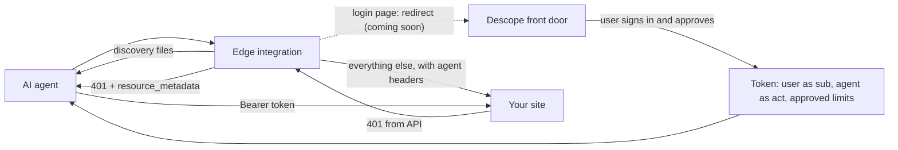
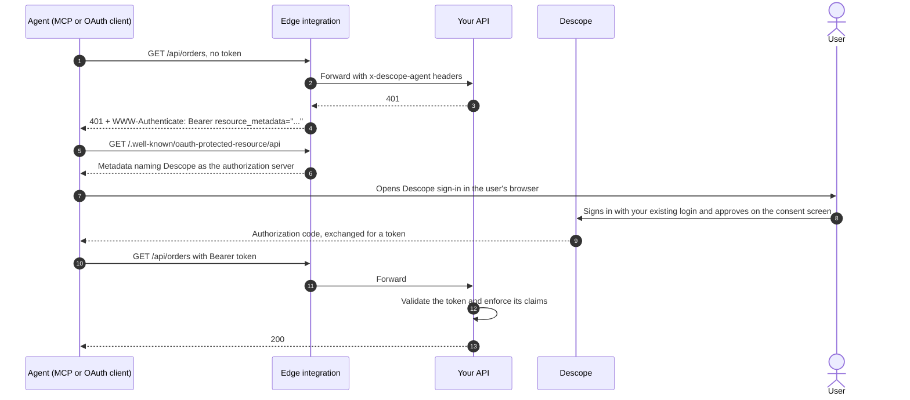
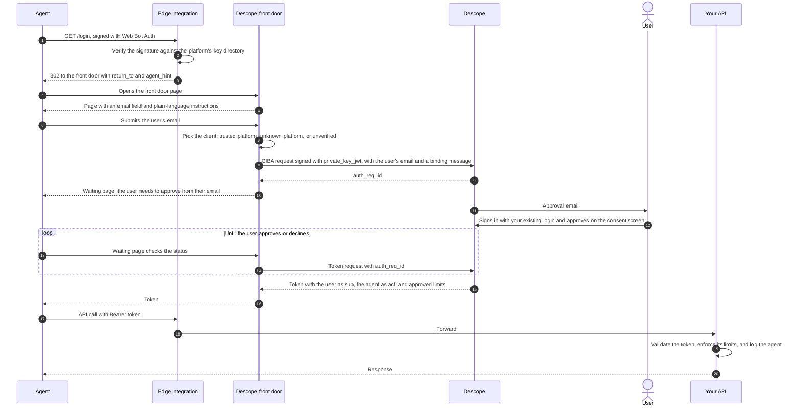

# agent-ready

Edge integrations that make a website ready for AI agents with [Descope](https://www.descope.com), without changing the app behind it.

Each integration runs in front of a site and does the same jobs:

- Verifies AI agents with Web Bot Auth, falling back to platform bot signals and user-agent hints.
- Serves discovery files (`/.well-known/oauth-protected-resource`, `/auth.md`, `/agents`) that point agents at a Descope authorization server.
- Adds a `resource_metadata` `WWW-Authenticate` challenge to API 401s so MCP and OAuth clients find Descope on their own.
- Adds an agent hint to login pages, and will route agents to a Descope-hosted front door once it's available.

Integrations start in monitor mode and fail open, so they can be deployed safely before they change any traffic.

## How it works

When an AI agent reaches a login page today, it asks the user for their password and signs in as them, so the site can't tell the agent from the customer. These integrations give agents their own way in. The agent is identified, the user approves what it may do from their own device, and Descope issues a token that names both the user and the agent and carries the limits the user approved. [Letting your customers' AI agents in](TODO-blog-url) covers the background.

The integration runs at the edge, in front of your site. For each request it:

1. **Answers discovery requests itself.** `/.well-known/oauth-protected-resource`, `/auth.md`, and `/agents` are served at the edge and point to your Descope project, so your origin never sees them.
2. **Checks whether the caller is an agent.** A valid Web Bot Auth signature, checked against the agent platform's published keys, marks the request `verified`. Without one, the platform's own bot signals and user-agent hints can still flag it, usually as `unverified`.
3. **Decides what to do.** In monitor mode it logs the agent and passes the request through. In route mode it also returns a 403 on paths agents may never use, such as password and payment changes. Once the front door is available, route mode will also redirect agents on login pages there.
4. **Forwards everything else** to your site, with `x-descope-agent` and `x-descope-agent-origin` headers so your app knows which requests came from agents.
5. **Adjusts the response.** A 401 from an API path gains a `WWW-Authenticate: Bearer resource_metadata="..."` header, which is how MCP and OAuth clients find Descope on their own. Login pages gain a hidden note for agents and a small "Signing in with an AI assistant?" link to `/agents`.

Descope handles the rest. The user signs in through your existing login and approves the request on a consent screen. Descope then issues a token with the user as the subject, the agent as the actor, and any limits the user approved. Your backend validates that token like any other JWT and enforces its claims. The integration identifies agents and shows them the way in. It doesn't authorize them.

The blog's Northbound sample app verifies agents in its own backend. These integrations do the same work at the edge, for sites that would rather not change their app.

## How an agent gets a token

There are two paths, depending on whether the agent can send the user to a sign-in page.

### Agents that can open a browser

MCP clients and other OAuth clients, such as Claude connecting to an MCP server, find Descope through the API's 401 and use the standard authorization code flow. They never go through the front door.

### Agents that can't open a browser (coming soon)

> This path needs the Descope-hosted front door, which isn't available yet. The diagram shows how it will work.

Computer use agents in a cloud VM and agents people reach over text message can't send the user to a sign-in page. They go through the front door, which asks the user for approval on their own device with CIBA.

The front door serves the page with the email field, so the edge integration never handles the user's email. Browser agents fill it in like any form. Agents that read `/auth.md` or `/agents` instead of the login page get pointed to the same page, starting at step 4.

What happens after approval depends on the agent. An agent that calls your API uses the token directly, as above. A computer use agent that keeps browsing your website needs a web session instead. The front door sets the access token as a cookie on your domain, so the agent's browser sends it on every request without adding a header. Your site has to accept the token from that cookie. See [Browser agents get a session cookie](demo/front-door/README.md#browser-agents-get-a-session-cookie).

## Next steps: accept the tokens in your backend

With the edge integration in place, agents have a standard way to sign in to your app on a user's behalf, and every token they get says which agent is acting for which user. The last step is on your side: accept those tokens.

### Validate the token

Descope issues standard OIDC tokens, so validate them whichever way fits your stack:

- **With a Descope backend SDK.** Validate the token in your app, the same way you would a Descope session.
- **At an API gateway.** Any gateway that validates JWTs against a JWKS, such as Kong, Envoy, or AWS API Gateway's JWT authorizer, can check the token using your Descope project's discovery document and pass the claims to your services. Your services still need to enforce the claims below, unless you configure the gateway to do it.

Either way, check the signature, issuer, audience, and expiry, and accept Descope tokens alongside your existing sessions.

### Use the claims

- **Read who is acting.** `sub` is the user. `act` is the agent. `azp` is the client the token was issued to, which names the platform only for trusted platforms with their own inbound app.
- **Enforce the limits.** Compare actions against the scopes and `authorization_details` in the token, for example rejecting a checkout above the approved amount with a 403 the agent can relay to the user.
- **Keep sensitive actions human-only.** Refuse password and payment method changes from any token that has an `act` claim.
- **Record the agent on every write,** so support can see which actions came from the customer and which came from their agent.
- **Ask for step-up on high-risk actions.** When an order crosses a threshold, start a new CIBA request for that specific order.

The `x-descope-agent` headers are useful for logging and for treating unauthenticated agent traffic differently. Base authorization decisions on the token, not the headers.

## Platforms

| Platform | Folder | Status |
| --- | --- | --- |
| Cloudflare Workers | [`cloudflare/`](cloudflare/) | Available |
| Vercel | — | Planned |
| Amazon CloudFront | — | Planned |

Each platform folder is a self-contained project with its own dependencies, tests, and README. Code is not shared between platforms yet; a common core may be extracted once a second platform exists.

## Demo

[`demo/front-door/`](demo/front-door/) is a stand-in for the Descope-hosted front door, so you can demo the full flow for agents that can't open a browser before the real one ships. It makes real Descope CIBA requests.
