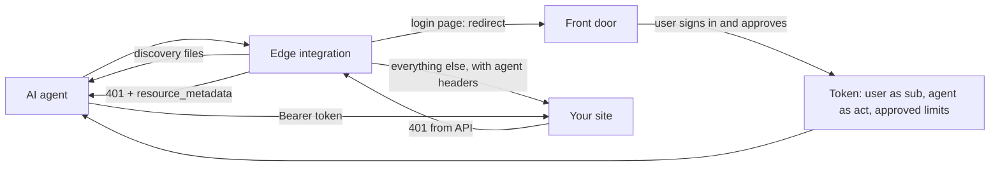
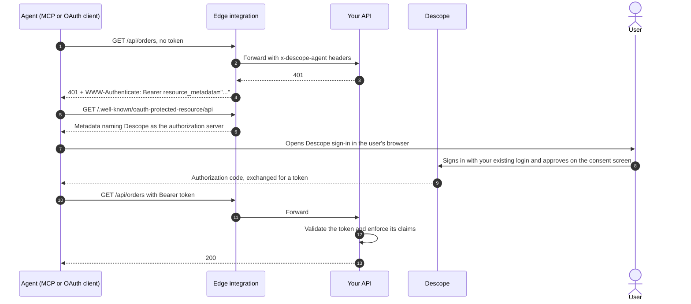
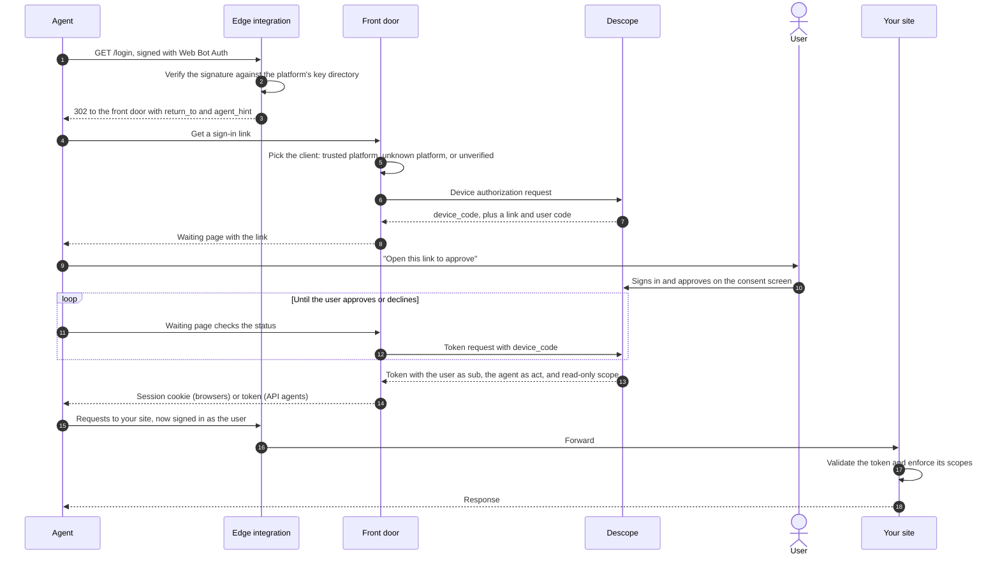

# Agent Edge

Agent Edge lets your customers' AI agents into your site through a sign-in path of their own, with [Descope](https://www.descope.com) as the authorization server, and without changing your site's login. It runs at the edge, in front of your site, and sends agents to the **front door**, where the customer approves them.

Each edge integration does the same jobs:

- Verifies AI agents with Web Bot Auth, falling back to platform bot signals and user-agent hints.
- Serves the protected resource metadata (`/.well-known/oauth-protected-resource`) and an `/agents` page that point agents at a Descope authorization server.
- Adds a `resource_metadata` `WWW-Authenticate` challenge to API 401s so MCP and OAuth clients find Descope on their own.
- Adds an agent hint to login pages, sends agents to the front door, and blocks them from pages they shouldn't use.

Integrations start in monitor mode and fail open, so they can be deployed safely before they change any traffic.

## What's in this repo

| Folder | What it is |
| --- | --- |
| [`cloudflare/`](cloudflare/) | The edge integration: a Cloudflare Worker you put in front of your site |
| [`front-door/`](front-door/) | An example front door, deployed to protect [Northbound](https://github.com/descope-sample-apps/northbound-sample-app): where agents get the customer's approval through Descope, with the device flow or CIBA |

Vercel and Amazon CloudFront integrations are coming soon. Each folder is a self-contained project with its own README.

> [!NOTE]
> A hosted front door is coming soon from Descope.

## How it works

When an AI agent reaches a login page today, it asks the user for their password and signs in as them, so the site can't tell the agent from the customer. These integrations give agents their own way in. The agent is identified, the user approves what it may do from their own device, and Descope issues a token that names both the user and the agent and carries the limits the user approved.

The integration runs at the edge, in front of your site. For each request, it:

1. Serves `/.well-known/oauth-protected-resource` and `/agents` itself. Both point to your Descope project, and neither request reaches your site.
2. Works out whether the caller is an agent. A valid Web Bot Auth signature, checked against the agent platform's published keys, makes it `verified`. Without a signature, the front door's session cookie, Cloudflare's verified-bot signal, or an agent-like user agent can still flag it, usually as `unverified`.
3. In monitor mode, logs the agent and lets the request through. In route mode, it also returns a 403 for pages agents shouldn't use, such as password and payment changes, and sends agents on your login page to the front door.
4. Forwards everything else to your site with `x-descope-agent` and `x-descope-agent-origin` headers, so your app can tell which requests came from agents.
5. Changes some responses on the way back. API 401s get a `WWW-Authenticate: Bearer resource_metadata="..."` header, which is how MCP and OAuth clients find Descope. Login pages get a hidden note for agents and, once a front door is set, a small "Signing in with an AI assistant?" link to `/agents`.

Descope handles the rest. The user signs in through your existing login and approves the request on a consent screen. Descope then issues a token with the user as the subject, the agent as the actor, and any limits the user approved. Your backend validates that token like any other JWT and enforces its claims. The integration identifies agents and shows them the way in. It doesn't authorize them.

The blog's Northbound sample app verifies agents in its own backend. These integrations do the same work at the edge, for sites that would rather not change their app.

## How an agent gets a token

There are two paths, depending on whether the agent can send the user to a sign-in page.

### Agents that can open a browser

MCP clients and other OAuth clients, such as Claude connecting to an MCP server, find Descope through the API's 401 and use the standard authorization code flow. They never go through the front door.

### Agents that can't open a browser

Computer use agents in a cloud VM and agents people reach over text message can't send the user to a sign-in page. They go through the front door. By default it uses the device flow: the agent gets a link from Descope, gives it to the user, and the user approves on their own device. Agents that can't pass on a link can send the user's email instead, and Descope emails the user an approval request (CIBA).

The edge integration never handles the user's email or the code; the front door does. Agents that go to `/agents` instead of the login page get pointed to the same front door page.

What happens after approval depends on the agent. An agent that calls your API uses the token directly, as above. A computer use agent that keeps browsing your website needs a web session instead. The front door sets the access token as a cookie on your domain, so the agent's browser sends it on every request without adding a header. Your site has to accept the token from that cookie. See [Browser agents get a session cookie](front-door/README.md#browser-agents-get-a-session-cookie).

### What the user sees when approving

CIBA doesn't skip signing in. The approval link opens a Descope flow, the CIBA approval flow you choose on the inbound app, and that flow does three things:

1. **Signs the user in.** Pick something that needs no setup, so approving takes seconds: a one-time code sent to the same email as the approval, a magic link, or social sign-in such as Google. To keep users on the login they already have, replace Descope's sign-in step with your own using the **External Authentication** action in the flow. Users then approve with the same account and credentials they use on your site today.
2. **Shows the consent screen.** This is the step that makes delegation meaningful. It tells the user, in plain language:
   - **which agent is asking**, and whether its platform was verified
   - **what it will be able to do**: the scopes requested
   - **the binding message**, including the short code the agent also shows the user, so they can check the request is theirs
   - **any limits**, from Rich Authorization Requests (RAR) once your authorization server supports them, such as "up to $200 at Northbound over the next 7 days"

   Consent only carries weight when the user can tell what they agreed to, so design this screen to be read, not clicked through.
3. **Records the decision.** The flow's CIBA Approval step marks the request approved or denied. The agent, which has been polling, gets its token or a refusal.

## Next steps: accept the tokens in your backend

With the edge integration in place, agents have a standard way to sign in to your app on a user's behalf, and every token they get says which agent is acting for which user. The last step is on your side: accept those tokens.

### Validate the token

Descope issues standard OIDC tokens, so validate them whichever way fits your stack:

- **With a Descope backend SDK.** Validate the token in your app, the same way you would a Descope session.
- **At an API gateway.** Any gateway that validates JWTs against a JWKS, such as Kong, Envoy, or AWS API Gateway's JWT authorizer, can check the token using your Descope project's discovery document and pass the claims to your services. Your services still need to enforce the claims below, unless you configure the gateway to do it.

Either way, check the signature, issuer, audience, and expiry, and accept Descope tokens alongside your existing sessions.

### Use the claims

- **Read who is acting.** `sub` is the user. `act` is the agent. `azp` is the client the token was issued to, which names the platform only for trusted platforms with their own inbound app.
- **Enforce the limits.** Compare actions against the scopes and `authorization_details` in the token, for example rejecting a checkout above the approved amount with a 403 the agent can relay to the user.
- **Keep sensitive actions human-only.** Refuse password and payment method changes from any token that has an `act` claim.
- **Record the agent on every write,** so support can see which actions came from the customer and which came from their agent.
- **Ask for step-up when the token isn't enough.** Your app decides which actions need the customer's approval, because only it knows what an action means, such as an order's total. When a token doesn't allow the action, ask for more instead of just refusing:
  - **For browser agents,** redirect to the front door's `/step-up` with a signed description of the action. The customer approves that exact action through Descope, and the agent comes back with a token that allows it. In Northbound, that's three lines at checkout and a small signing helper. See [Step-up for purchases](front-door/README.md#step-up-for-purchases) for the flow.
  - **For APIs,** return `403` with `WWW-Authenticate: Bearer error="insufficient_scope", scope="orders:write"` (RFC 6750). OAuth and MCP clients read that and ask the customer for the extra scope.

The `x-descope-agent` headers are useful for logging and for treating unauthenticated agent traffic differently. Base authorization decisions on the token, not the headers.
