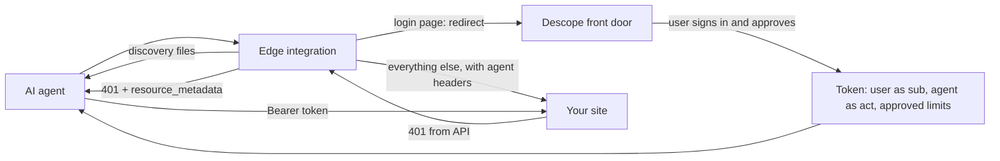

# agent-ready

Edge integrations that make a website ready for AI agents with [Descope](https://www.descope.com), without changing the app behind it.

Each integration runs in front of a site and does the same jobs:

- Verifies AI agents with Web Bot Auth, falling back to platform bot signals and user-agent hints.
- Serves discovery files (`/.well-known/oauth-protected-resource`, `/auth.md`, `/agents`) that point agents at a Descope authorization server.
- Adds a `resource_metadata` `WWW-Authenticate` challenge to API 401s so MCP and OAuth clients find Descope on their own.
- Adds an agent hint to login pages and routes agents to a Descope-hosted front door.

Integrations start in monitor mode and fail open, so they can be deployed safely before they change any traffic.

## How it works

When an AI agent reaches a login page today, it asks the user for their password and signs in as them, so the site can't tell the agent from the customer. These integrations give agents their own way in. The agent is identified, the user approves what it may do from their own device, and Descope issues a token that names both the user and the agent and carries the limits the user approved. [Letting your customers' AI agents in](TODO-blog-url) covers the background.

The integration runs at the edge, in front of your site. For each request it:

1. **Answers discovery requests itself.** `/.well-known/oauth-protected-resource`, `/auth.md`, and `/agents` are served at the edge and point to your Descope project, so your origin never sees them.
2. **Checks whether the caller is an agent.** A valid Web Bot Auth signature, checked against the agent platform's published keys, marks the request `verified`. Without one, the platform's own bot signals and user-agent hints can still flag it, usually as `unverified`.
3. **Decides what to do.** In monitor mode it logs the agent and passes the request through. In route mode it also redirects agents on login pages to the Descope front door and returns a 403 on paths agents may never use, such as password and payment changes.
4. **Forwards everything else** to your site, with `x-descope-agent` and `x-descope-agent-origin` headers so your app knows which requests came from agents.
5. **Adjusts the response.** A 401 from an API path gains a `WWW-Authenticate: Bearer resource_metadata="..."` header, which is how MCP and OAuth clients find Descope on their own. Login pages gain a hidden note for agents and a small "Signing in with an AI assistant?" link to `/agents`.

Descope handles the rest. The user signs in through your existing login and approves the request on a consent screen. Descope then issues a token with the user as the subject, the agent as the actor, and any limits the user approved. Your backend validates that token like any other JWT and enforces its claims. The integration identifies agents and shows them the way in. It doesn't authorize them.

The blog's Northbound sample app verifies agents in its own backend. These integrations do the same work at the edge, for sites that would rather not change their app.

## Platforms

| Platform | Folder | Status |
| --- | --- | --- |
| Cloudflare Workers | [`cloudflare/`](cloudflare/) | Available |
| Vercel | — | Planned |
| Amazon CloudFront | — | Planned |

Each platform folder is a self-contained project with its own dependencies, tests, and README. Code is not shared between platforms yet; a common core may be extracted once a second platform exists.
