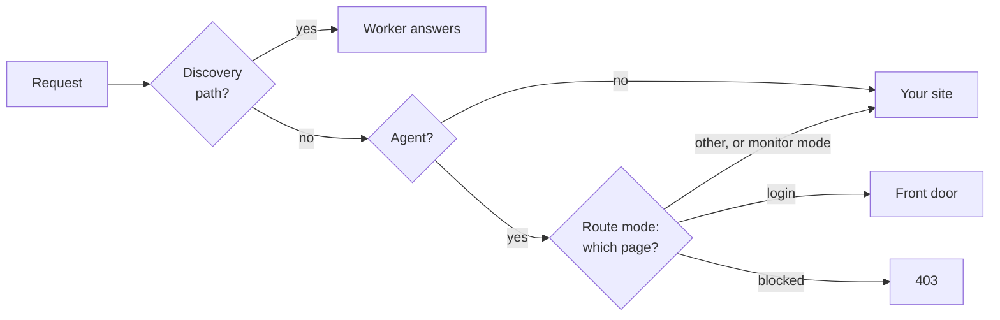

# Agent Edge for Cloudflare

[](https://deploy.workers.cloudflare.com/?url=https://github.com/descope/agent-edge/tree/main/cloudflare)

A Cloudflare Worker that sits in front of your site and lets customers' AI agents in, with Descope as the authorization server. Your site's login doesn't change.

## What it does



- **Finds agents** by Web Bot Auth signature, the front door's session cookie, Cloudflare's verified bots, or their user agent.
- **Shows them the way in:** an `/agents` page, the protected resource metadata, a note on your login pages, and a `resource_metadata` challenge on your API's 401s.
- **Routes them,** in route mode: agents on your login page go to the [front door](../front-door/), and pages such as payment methods return a 403.
- **Tells your site** with `x-descope-agent` headers. Trust them only if your site is reachable only through Cloudflare.

It identifies agents. What they can do comes from the Descope token, which your site checks. It starts in monitor mode, which only logs, and if anything breaks, requests go to your site unchanged.

## Install it

You need a site proxied through Cloudflare, a Descope project, and Node.js 22.

1. **Get the code.**

   ```sh
   git clone https://github.com/descope/agent-edge.git
   cd agent-edge/cloudflare
   npm install
   ```

2. **Set the basics in `wrangler.toml`.**

   ```toml
   SITE_NAME = "Northbound"
   DESCOPE_ISSUER = "https://api.descope.com/v1/apps/<your project ID>"
   RESOURCE_URL = "https://example.com/api"
   LOGIN_PATHS = "/login"
   BLOCKED_AGENT_PATHS = "/account/password,/account/payment-methods*"
   ```

3. **Add your route.** Uncomment `routes` and use your zone:

   ```toml
   routes = [{ pattern = "example.com/*", zone_name = "example.com" }]
   ```

4. **Deploy in monitor mode** and watch for `agent_detected` with `npx wrangler tail`.

   ```sh
   npm run deploy
   ```

5. **Connect the front door.** Deploy the [front door](../front-door/) on a subdomain, set `FRONT_DOOR_URL`, and give both the same hint secret:

   ```sh
   npx wrangler secret put HINT_SIGNING_SECRET
   ```

6. **Switch to route mode** with `MODE = "route"` and deploy again.

Then have your site accept the tokens. See [Accepting the tokens in your backend](../README.md#accepting-the-tokens-in-your-backend).

## Settings

| Setting | What it does |
| --- | --- |
| `MODE` | `monitor` (default) logs only. `route` also redirects and blocks. |
| `SITE_NAME` | Your site's name, shown to agents and customers |
| `DESCOPE_ISSUER` | Your Descope authorization server. Required. |
| `RESOURCE_URL` | The API identifier agents request tokens for. Required. |
| `FRONT_DOOR_URL` | Where agents go to connect |
| `HINT_SIGNING_SECRET` | Shared with the front door, to pass on what the Worker verified |
| `LOGIN_PATHS`, `BLOCKED_AGENT_PATHS`, `API_PATHS` | Comma-separated paths. A trailing `*` matches a prefix. |
| `AGENT_USER_AGENT_PATTERNS` | User agents to treat as unverified agents |
| `TRUST_CLOUDFLARE_VERIFIED_BOTS`, `CLOUDFLARE_AGENT_BOT_CATEGORIES` | Treat these Cloudflare-verified bots as verified agents |
| `INJECT_LOGIN_HINT`, `LOGIN_HINT_VISIBLE` | The note and link on login pages. Both on by default. |
| `SCOPES_SUPPORTED`, `AUTHORIZATION_DETAILS_TYPES` | Listed in the protected resource metadata |
| `AGENT_SESSION_COOKIE` | The front door's session cookie. Defaults to `DS`. |
| `UPSTREAM_ORIGIN` | Local testing only: the site to forward to |

The code is in `src/`: `index.ts` handles each request, `agentDetection.ts` finds agents, `discovery.ts` serves `/agents` and the metadata, and `loginHint.ts` writes the login-page note. If your site already serves `/agents`, remove that route from `index.ts`.

## Test it

```sh
npm test           # unit tests
npm run test:e2e   # the Worker in workerd, in front of a fake site
```

To run it locally, point it at a site. Without `UPSTREAM_ORIGIN` it returns a `508` rather than forwarding to itself.

```sh
npx wrangler dev --var UPSTREAM_ORIGIN:http://localhost:3000
```
