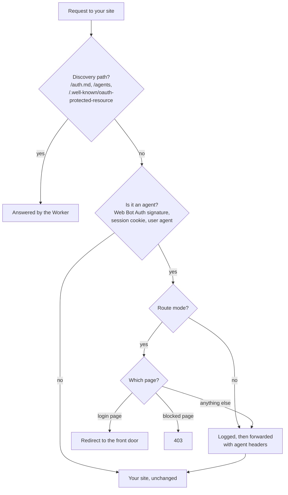

# Agent Edge for Cloudflare

[](https://deploy.workers.cloudflare.com/?url=https://github.com/descope/agent-edge/tree/main/cloudflare)

A Cloudflare Worker you put in front of your site to let customers' AI agents in, with Descope as the authorization server. It finds agents, shows them a sign-in path that doesn't need the customer's password, and keeps them away from pages they shouldn't use. Your site's login doesn't change.

## What it does



- **Finds agents.** It checks Web Bot Auth signatures against each agent platform's published keys. It also recognizes the front door's session cookie, Cloudflare's verified bots, and agent-like user agents.
- **Shows agents the way in.** It serves `auth.md`, an `/agents` page and the OAuth protected resource metadata. It also adds a note for agents to your login pages and a `resource_metadata` challenge to your API's 401s, so MCP and OAuth clients find Descope on their own.
- **Routes agents.** In route mode, it sends agents on your login page to the [front door](../front-door/), where the customer approves them through Descope. It blocks agents from pages such as password and payment changes.
- **Tells your site.** Each request it forwards gets an `x-descope-agent` header (`verified` or `unverified`) and, for verified agents, `x-descope-agent-origin`.

It starts in **monitor mode**, which only logs agents, so you can see your real agent traffic before it changes anything. It fails open: if it's misconfigured or something breaks, requests pass through to your site unchanged.

## Install it in front of your site

You need a site proxied through Cloudflare, a Descope project, and Node.js 22.

1. **Get the code.**

   ```sh
   git clone https://github.com/descope/agent-edge.git
   cd agent-edge/cloudflare
   npm install
   ```

2. **Set the basics in `wrangler.toml`:**

   ```toml
   SITE_NAME = "Northbound"
   DESCOPE_ISSUER = "https://api.descope.com/v1/apps/<your project ID>"
   RESOURCE_URL = "https://example.com/api"
   LOGIN_PATHS = "/login"
   BLOCKED_AGENT_PATHS = "/account/password,/account/payment-methods*"
   ```

3. **Point it at your site.** Uncomment `routes` and replace `example.com` with your zone:

   ```toml
   routes = [{ pattern = "example.com/*", zone_name = "example.com" }]
   ```

4. **Deploy in monitor mode,** then watch agent traffic with `npx wrangler tail` or the Worker's logs in the Cloudflare dashboard. Look for `agent_detected`.

   ```sh
   npm run deploy
   ```

5. **Connect the front door.** Deploy the [front door](../front-door/) on a subdomain such as `agents.example.com`, then set it here, along with a hint secret both sides share:

   ```toml
   FRONT_DOOR_URL = "https://agents.example.com"
   ```

   ```sh
   npx wrangler secret put HINT_SIGNING_SECRET
   ```

6. **Switch to route mode** once the logs look right. Set `MODE = "route"` and deploy again.

Your site's last step is accepting the Descope token the front door gives agents. See [Next steps: accept the tokens in your backend](../README.md#next-steps-accept-the-tokens-in-your-backend).

## Customize it

| To change | Edit |
| --- | --- |
| Which pages count as your login | `LOGIN_PATHS` |
| Pages agents may never use | `BLOCKED_AGENT_PATHS` |
| Which API paths get the Descope pointer on 401 | `API_PATHS` |
| The name agents and customers see | `SITE_NAME` |
| The note and link added to login pages | `INJECT_LOGIN_HINT`, `LOGIN_HINT_VISIBLE`, or `src/loginHint.ts` |
| What `auth.md` and `/agents` say | `src/discovery.ts` |
| How agents are recognized | `AGENT_USER_AGENT_PATTERNS`, or `src/agentDetection.ts` |
| What happens to each request | `src/index.ts` |

If your site already serves `/agents`, `/auth.md` or `/.well-known/auth.md`, rename yours or remove those routes from `src/index.ts`.

### All settings

| Setting | What it does |
| --- | --- |
| `MODE` | `monitor` (default) logs only. `route` also redirects and blocks. |
| `SITE_NAME` | Your site's name. Use the same one on the front door. |
| `DESCOPE_ISSUER` | Your Descope authorization server. Required. |
| `RESOURCE_URL` | The API identifier agents request tokens for. Required. |
| `FRONT_DOOR_URL` | The front door. Without it, agents on login pages aren't redirected and login pages get no visible link. |
| `HINT_SIGNING_SECRET` | Secret, shared with the front door, for passing on what the Worker verified. |
| `LOGIN_PATHS`, `BLOCKED_AGENT_PATHS`, `API_PATHS` | Comma-separated paths. A trailing `*` matches a prefix. `API_PATHS` defaults to `/api/*`. |
| `SCOPES_SUPPORTED`, `AUTHORIZATION_DETAILS_TYPES` | Listed in the protected resource metadata. |
| `AGENT_USER_AGENT_PATTERNS` | User-agent substrings that suggest an unverified agent. |
| `TRUST_CLOUDFLARE_VERIFIED_BOTS`, `CLOUDFLARE_AGENT_BOT_CATEGORIES` | Treat Cloudflare-verified bots in these categories as verified agents. |
| `INJECT_LOGIN_HINT`, `LOGIN_HINT_VISIBLE` | Add the agent note, and the visible "Signing in with an AI assistant?" link, to login pages. Both default to `true`. |
| `AGENT_SESSION_COOKIE` | The cookie the front door sets once an agent is signed in. Defaults to `DS`. |
| `UPSTREAM_ORIGIN` | Local testing only: the site to forward to. |

## Test it

```sh
npm test           # unit tests, including real Web Bot Auth signatures
npm run test:e2e   # runs the Worker in workerd in front of a fake site
```

To run it locally, give it a site to forward to. Locally there's nothing behind it, and without `UPSTREAM_ORIGIN` it stops with a `508` instead of forwarding requests to itself.

```sh
npx wrangler dev --var UPSTREAM_ORIGIN:http://localhost:3000
```

Then, with `MODE:route` and `FRONT_DOOR_URL` set:

```sh
curl http://localhost:8787/auth.md
curl -I -A "HeadlessChrome" http://localhost:8787/login   # 302 to the front door
curl -I http://localhost:8787/api/orders                  # 401 with WWW-Authenticate: Bearer resource_metadata=...
```

## Good to know

- **It identifies agents. It doesn't authorize them.** What an agent may do comes from the Descope token, and your site enforces it.
- **User agents can be faked,** so agents found that way are marked `unverified`.
- **Trust the `x-descope-agent` headers only if your site accepts traffic exclusively through Cloudflare.** The Worker strips any copies a client sends.
- **There's no replay cache for Web Bot Auth signatures yet,** and key directory signatures aren't verified. That's fine for routing, but add both before relying on verification for anything more sensitive.
- **Inline styles.** The login-page note uses them, so a strict Content Security Policy can make it visible. Allow it in your policy, or set `INJECT_LOGIN_HINT = "false"`.
