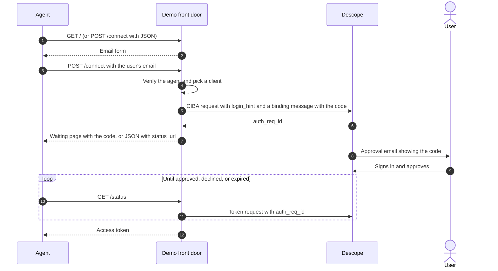

# Demo front door

A stand-in for the Descope-hosted agent front door, so you can demo the full flow before the real one ships. It runs as a Cloudflare Worker and makes **real** Descope CIBA requests: the user gets a real approval email, signs in with their normal login, and sees the real consent screen.

It's for demos only. Delete it once Descope's hosted front door is available.

## What it does

1. **Shows agents an email form.** `GET /` serves a page with a hidden note for agents and a field for the user's email. Agents without a browser can `POST /connect` with JSON instead.
2. **Works out who the agent is.** It verifies a Web Bot Auth signature on the request itself, or trusts the edge integration's signed `agent_hint`, or treats the agent as unverified.
3. **Picks a client for that tier.** Trusted platforms get their own inbound app. Verified agents from other platforms share one client, and unverified agents share another.
4. **Starts a real CIBA request** against your Descope inbound app. The approval message names the tier and includes a short code that the agent also shows the user, so the user can check that the request is theirs.
5. **Waits for approval.** The waiting page, or an agent calling `GET /status`, polls Descope until the user approves or declines, then returns the access token. The refresh token stays with the front door.

Each request also gets an agent ID (`agt_...`) that's logged with every event, so requests on the shared clients can be told apart.



## Set up Descope

1. **Create an inbound app** for unverified agents, and turn on **CIBA** in its settings. Pick an email connector and template for the approval email.
2. **Optionally create more inbound apps:** one shared app for verified agents from unknown platforms, and one for each platform you trust.
3. **Copy the inbound app's Discovery URL** from the Descope Console. The front door reads the CIBA and token endpoints from it.
4. **Choose how the front door authenticates:**
   - **`private_key_jwt` (preferred).** It's available on request, so ask Descope to turn it on for your project. Run `npm run generate-key` and save the output as `PRIVATE_KEY_JWK`. Then register the front door's public key with each inbound app, either by pointing the app at `https://<front door>/jwks.json` or by pasting the key.
   - **Client secrets.** Set `CLIENT_SECRETS` to a JSON map from each client ID to its secret.

## Run it

```sh
cd demo/front-door
npm install
cp .dev.vars.example .dev.vars   # fill in STATE_SECRET and your credentials
npm run dev                      # http://localhost:8788
```

Fill in `DESCOPE_DISCOVERY_URL`, `UNVERIFIED_CLIENT_ID`, and optionally `VERIFIED_CLIENT_ID` and `TRUSTED_PLATFORMS` in `wrangler.toml`.

To run the whole flow locally, start the edge integration in route mode and point it here. Use the same `HINT_SIGNING_SECRET` in both:

```sh
cd cloudflare
npx wrangler dev --var MODE:route --var FRONT_DOOR_URL:http://localhost:8788 \
  --var HINT_SIGNING_SECRET:same-as-front-door --var UPSTREAM_ORIGIN:https://staging.example.com
```

Then send an agent to a login page through the edge integration. For a quick check without an agent:

```sh
curl -X POST http://localhost:8788/connect -H 'content-type: application/json' -d '{"email":"you@example.com"}'
curl "http://localhost:8788/status?handle=<handle from the response>"
```

## Endpoints

| Endpoint | What it does |
| --- | --- |
| `GET /` | The email form. Keeps `return_to` and `agent_hint` from the edge integration's redirect. |
| `POST /connect` | Starts a CIBA request. Takes a form post or JSON `{ "email": "...", "agent_hint": "..." }`. JSON callers get `{ handle, code, agent_id, tier, status_url, interval, expires_in }`. |
| `GET /status?handle=...` | Polls Descope. Returns `pending`, `approved` with the access token, `denied`, `expired`, or `error`. |
| `GET /jwks.json` | The front door's public key, for registering `private_key_jwt` with your inbound apps. |

## What it leaves out

The real front door needs more than this demo has:

- **No rate limits.** Anyone can make it send approval emails to any address. Don't leave it running on a public URL.
- **Whoever holds the handle gets the token.** The handle is the encrypted request state. It isn't tied to the agent that started the request.
- **No nonce replay cache** for Web Bot Auth signatures, and no verification of key directory signatures.
- **The agent ID isn't in the token yet.** It's logged, and only appears in the token if Descope is set up to add it as a custom claim.
- **No refresh.** The agent gets a fresh token by starting again.

## Open questions for the real front door

- **The `private_key_jwt` audience.** The assertion lists both the issuer and the endpoint as its audience. Confirm which one Descope expects.
- **Getting the agent ID into the token,** most likely through a custom claim set in the consent flow.
- **The approval message.** Confirm that Descope shows the `binding_message` to the user in the approval email or on the consent screen.
