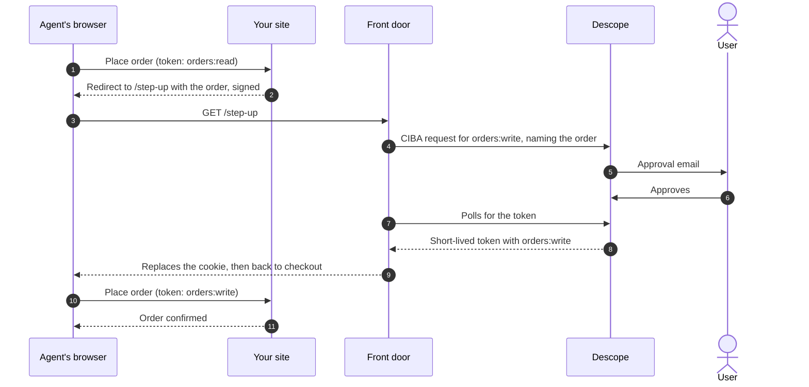

# Agent front door

An example front door, deployed in front of [Northbound](https://github.com/descope-sample-apps/northbound-sample-app). Agents that can't open a browser come here to get the customer's approval through Descope, and leave with a token.

> [!NOTE]
> A hosted front door is coming soon from Descope.

## What it does

1. **Connects the agent.** The agent asks for a sign-in link and passes it to the user (the device flow). If it can't pass on a link, it can enter the user's email instead, and Descope emails them (CIBA). Agents without a browser can do the same with `POST /connect`.
2. **Works out who the agent is,** from a Web Bot Auth signature or the edge integration's signed hint, and picks an inbound app for that tier: a trusted platform, a verified agent from elsewhere, or an unverified agent.
3. **Asks Descope for read-only access** (`orders:read`). The user approves on their own device.
4. **Signs the agent in.** A browser waits on `/wait`, which is safe to reload. Once the user approves, the front door sets the token as a cookie on your domain and sends the browser back to your site. API agents get the token from `GET /status`.
5. **Handles step-up.** When your site needs approval for a purchase, it sends the agent to `/step-up`. See [Step-up for purchases](#step-up-for-purchases).

## Set up Descope

1. **Create an inbound app** and name it for what users should see, such as "Unverified agent". Turn on the device authorization flow and CIBA.
2. **Set up the approval flow** that runs when the user opens the link. It signs them in and shows the consent screen. Use Descope sign-in (an email code or Google), or add the External Authentication action so users approve with their existing account on your site. It's your choice.
3. **Define two scopes,** on the inbound app or on a resource. Their descriptions appear on the consent screen.
   - `orders:read`, such as "View your orders", requested when an agent connects.
   - `orders:write`, such as "Place an order for you", requested at step-up. Give these tokens a short lifetime.

   Tokens need `email` and `act` (the agent in `act.sub`). If the scopes are on a resource, set `RESOURCE` to it.
4. **Copy the inbound app's Discovery URL** into `DESCOPE_DISCOVERY_URL`.
5. **Pick how the front door authenticates.** Set `CLIENT_SECRETS` to a JSON map of client IDs to secrets, or use `private_key_jwt`: ask Descope to enable it, run `npm run generate-key`, save the result as `PRIVATE_KEY_JWK`, and register `https://<front door>/jwks.json` with the inbound app. If `PRIVATE_KEY_JWK` is set, it takes priority.

Optionally, create more inbound apps for verified agents and for platforms you trust.

## Run it

```sh
cd front-door
npm install
cp .dev.vars.example .dev.vars   # STATE_SECRET and your credentials
npm run dev                      # http://localhost:8788
```

In `wrangler.toml`, set `SITE_NAME`, `DESCOPE_DISCOVERY_URL`, and `UNVERIFIED_CLIENT_ID`. To deploy on your domain, add it as a custom domain (for example `agents.example.com`) and set `COOKIE_DOMAIN` to your site's domain. A cookie set from `workers.dev` won't reach your site.

## Browser agents get a session cookie

A computer use agent browses your site like a person, so it gets a session cookie instead of adding a header. Descope delivers the token to the front door server to server, so the front door sets the cookie itself, when the user approves:

- `DS` holds the access token, on your domain, so your site can read it. Your site validates it like a bearer token.
- `DSR` holds the encrypted refresh token, and only goes to the front door's `/refresh`.

## Step-up for purchases

Agents connect read-only. When one tries to buy, your site sends it to the front door to get the customer's approval for that order.



Your site signs the order (`{ email, amount, exp }`) with `STEP_UP_SECRET`, which it shares with the front door, so the agent can't change what the user sees. The token only carries the scope, not the amount, so keep `orders:write` tokens short-lived.

## Endpoints

| Endpoint | What it does |
| --- | --- |
| `GET /` | The connect page |
| `POST /connect` | Starts a connection: the device flow by default, CIBA with an email. Returns JSON for JSON requests. |
| `GET /wait` | The waiting page for a browser. Returns it to your site once approved. |
| `GET /status` | Polls for the token. For API agents. |
| `GET /step-up` | Starts approval for one action your site signed |
| `GET`/`POST /refresh` | Renews the access token from the refresh cookie |
| `GET /jwks.json` | The front door's public key, for `private_key_jwt` |

## Built-in protections

- `/connect` is rate limited per IP and per email, before anything reaches Descope.
- A request only works in the browser or from the IP that started it.
- Client credentials stay in the front door.
- If Descope refuses a request, agents see a plain message and the reason goes to the logs.
