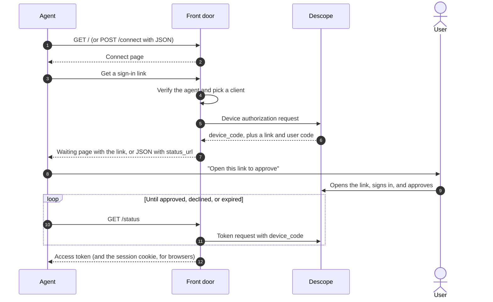
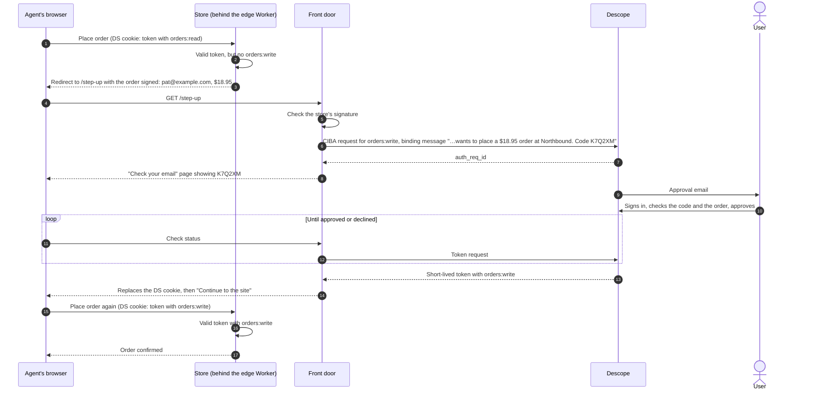

# Agent front door

An example implementation of the agent front door, deployed to protect [Northbound](https://github.com/descope-sample-apps/northbound-sample-app). It shows roughly how a front door serves Descope to an agent. It's where agents that can't open a browser go to get the customer's approval, with the device flow or CIBA, before getting a Descope token.

> [!NOTE]
> A hosted front door is coming soon from Descope.

## What it does

1. **Offers two ways to connect.** `GET /` serves a page with a hidden note for agents. The main option is **Get a sign-in link** (the device flow): the agent gets a link to give the user, and nobody is sent anything they didn't ask for. Below it, for agents that can't pass on a link, is an email field (CIBA), which sends the user an approval email and is rate limited per address. Agents without a browser can `POST /connect` with JSON instead.
2. **Works out who the agent is.** It verifies a Web Bot Auth signature on the request itself, or trusts the edge integration's signed `agent_hint`, or treats the agent as unverified.
3. **Picks a client for that tier.** Trusted platforms get their own inbound app. Verified agents from other platforms share one client, and unverified agents share another.
4. **Starts the approval with Descope,** read-only (`orders:read`) by default.
   - **Device flow:** Descope returns a link with the code already in it. The user opens it on their own device, signs in, and approves. The consent screen shows the inbound app's name, so name each tier's app for the user, for example "Unverified agent".
   - **CIBA:** Descope emails the user. The approval message says who is asking and what they want, with a short code the agent also shows: "An unverified agent wants to view your orders at Northbound. Code K7Q2XM".
5. **Waits for approval.** A browser lands on `/wait`, which can be reloaded safely. It polls Descope until the user approves or declines, then sets the agent's session cookie and returns the browser to the page it came from. An agent calling `GET /status` gets the access token instead. The refresh token stays with the front door.

When an agent sends the user's email instead of asking for a link, the front door uses CIBA: Descope emails the user directly, and the agent shows them the matching code. Set `CIBA_FALLBACK = "false"` to turn this path off, so agents can only connect with a code.

Each request also gets an agent ID (`agt_...`) that's logged with every event, so requests on the shared clients can be told apart.

## Browser agents get a session cookie

A computer use agent uses your site through a browser, like a person does. It shouldn't have to add an `Authorization: Bearer` header to every request, and usually can't.

Descope can't set this cookie itself. With the device flow and CIBA, the token goes from Descope's token endpoint to the front door, server to server, and never passes through the agent's browser. The one browser response the front door controls is the waiting page's `/status` call in the agent's own browser, so the front door sets the cookies there:

| Cookie | Holds | Scope |
| --- | --- | --- |
| `DS` | The access token | `Domain=COOKIE_DOMAIN; Path=/`, so your site receives it on every request. Expires with the token. |
| `DSR` | The refresh token, sealed with `STATE_SECRET` | The front door's `/refresh` only. It never reaches your site, and the browser can't read it. |

Both are `HttpOnly` and `SameSite=Lax`, and `Secure` over https.

For this to work:

- **The front door has to be on a subdomain of your site,** such as `agents.example.com` for `example.com`, with `COOKIE_DOMAIN = "example.com"`. A browser won't send a cookie set by `workers.dev` to your site. Add the front door as a custom domain on your zone instead.
- **Your site has to accept the token from the cookie.** Validate it the same way as a bearer token: with a Descope backend SDK reading the `DS` cookie, or at a gateway that reads it from the cookie.
- **Refreshing goes through the front door.** Refreshing needs the front door's client credentials, so the browser can't do it alone. When the access token expires, send the browser to `https://agents.example.com/refresh?return_to=<page>`. The front door uses the `DSR` cookie, sets a new `DS`, and redirects back. `POST /refresh` does the same and returns JSON. If the refresh fails, both cookies are cleared and the agent has to connect again.

Agents that call your API directly still get the access token in the `/status` JSON and send it as a bearer token.



## Set up Descope

1. **Create an inbound app** for unverified agents, and name it for what the user should see, such as "Unverified agent".
   - Turn on the **device authorization flow**. The front door offers sign-in links only when the app's discovery document lists a `device_authorization_endpoint`.
   - Turn on **CIBA** for step-up and the email fallback. Pick an email connector and template, and the flow that runs when the user opens the approval link. That flow signs the user in and shows the consent screen. See [What the user sees when approving](../README.md#what-the-user-sees-when-approving).
2. **Define the scopes the front door asks for,** on a resource (for example `https://example.com/agent_resource`) or on the inbound app. Their descriptions are what customers read on the consent screen.
   - `orders:read`, such as "View your orders", requested when an agent connects.
   - `orders:write`, such as "Place an order for you", requested only at step-up. Give these tokens a short lifetime, so one approval covers about one purchase.

   Make sure tokens include `email` (to find the customer) and `act` with the agent in `act.sub`. If the scopes belong to a resource, set `RESOURCE` to it, so the front door sends it with each request. If the front door asks for a scope Descope doesn't know, agents see "This site can't connect agents right now" and the reason is in the front door's logs.
3. **Optionally create more inbound apps:** one shared app for verified agents from unknown platforms, and one for each platform you trust.
4. **Copy the inbound app's Discovery URL** from the Descope Console. The front door reads the device, CIBA, and token endpoints from it.
5. **Choose how the front door authenticates:**
   - **`private_key_jwt` (preferred).** It's available on request, so ask Descope to turn it on for your project. Run `npm run generate-key` and save the output as `PRIVATE_KEY_JWK`. Then register the front door's public key with each inbound app, either by pointing the app at `https://<front door>/jwks.json` or by pasting the key.
   - **Client secrets.** Set `CLIENT_SECRETS` to a JSON map from each client ID to its secret.

   If `PRIVATE_KEY_JWK` is set, the front door always uses `private_key_jwt`, even when `CLIENT_SECRETS` is also set. Until Descope turns on `private_key_jwt` for your project, leave `PRIVATE_KEY_JWK` unset, or Descope rejects every request with `E011002 ... missing secret`.

## Run it

```sh
cd front-door
npm install
cp .dev.vars.example .dev.vars   # fill in STATE_SECRET and your credentials
npm run dev                      # http://localhost:8788
```

In `wrangler.toml`, set `SITE_NAME` to your site's name (for example `"Northbound"`); it appears on the connect page and in the approval message the user sees. Then fill in `DESCOPE_DISCOVERY_URL`, `UNVERIFIED_CLIENT_ID`, and optionally `VERIFIED_CLIENT_ID` and `TRUSTED_PLATFORMS`. Use the same `SITE_NAME` as the edge integration.

To run the whole flow locally, start the edge integration in route mode and point it here. Use the same `HINT_SIGNING_SECRET` in both:

```sh
cd cloudflare
npx wrangler dev --var MODE:route --var FRONT_DOOR_URL:http://localhost:8788 \
  --var HINT_SIGNING_SECRET:same-as-front-door --var UPSTREAM_ORIGIN:https://staging.example.com
```

Then send an agent to a login page through the edge integration. For a quick check without an agent:

```sh
curl -X POST http://localhost:8788/connect -H 'content-type: application/json' -d '{"email":"you@example.com"}'
curl "http://localhost:8788/status?handle=<handle from the response>"
```

## Endpoints

| Endpoint | What it does |
| --- | --- |
| `GET /` | The email form. Keeps `return_to` and `agent_hint` from the edge integration's redirect. |
| `POST /connect` | Starts a connection. With no email, or with `flow=device`, starts the device flow: JSON callers get `{ flow, handle, user_code, verification_uri, verification_uri_complete, agent_id, tier, status_url, interval, expires_in }`, and an email, if given, is passed as `login_hint`. With an email, starts CIBA: JSON callers get `code` instead of the user code and link. Takes a form post or JSON. Returns `429` when rate limited. |
| `GET /wait?handle=...` | The waiting page a browser lands on after connecting or step-up. Reloading it shows the same request. Once approved, it returns the browser to `return_to`. Only works in the browser that started the request. |
| `GET /status?handle=...` | Polls Descope. Returns `pending` with the `interval` to wait, `approved` with the access token, `denied`, `expired`, or `error`. If Descope asks it to slow down, `pending` also includes a new `handle` with a longer interval; use it for later polls. Returns `403` if called from a different client than the one that started the request. |
| `GET /jwks.json` | The front door's public key, for registering `private_key_jwt` with your inbound apps. |
| `GET` or `POST /refresh` | Uses the `DSR` cookie to get a new access token and set a new `DS` cookie. `GET` with `return_to` redirects back; `POST` returns JSON. |
| `GET /step-up?request=...&return_to=...` | Starts a step-up for one action the store signed, such as a purchase on a read-only connection. Returns the waiting page. On approval, replaces the access cookie with a token that has `STEP_UP_SCOPE`. |

## Step-up for purchases

Agents connect read-only, and step up when they try to buy something. Agent platforms such as Muse already ask the user before every purchase, but the store can't see that prompt or check that it happened. Step-up gives the store an approval it can verify, at the moment the agent tries to do more than it was granted.



If the user declines, the waiting page says so, the agent's token stays read-only, and the order isn't placed.

1. **The store refuses and sends the agent here.** When an agent whose token lacks `orders:write` places an order, the store redirects it to `/step-up?request=...&return_to=...`. The `request` describes the order, `{ email, amount, exp }`, and is signed with `STEP_UP_SECRET`, which the store and front door share. The agent can't change what the user will see.
2. **The front door asks Descope.** It starts a CIBA request for `STEP_UP_SCOPE` (`openid orders:write`), using the same client as the agent's original connection, with a message naming the order: "An unverified agent wants to place a $18.95 order at Northbound. Code K7Q2XM".
3. **The user approves on their own device,** and the front door replaces the agent's access cookie with the new token. The refresh cookie from the original read-only connection stays as it is.
4. **The agent goes back to checkout** and places the order. This time the token has `orders:write`.

The approval message shows the exact amount, but the token only carries the scope. That's why the `orders:write` token should be short-lived, set in Descope, so one approval covers about one purchase. Rich Authorization Requests (RFC 9396) would put the exact amount in the token, and the store could check it.

## Protections built in

- **Rate limits on `/connect`:** 10 requests a minute per IP and 3 per email address, checked before anything reaches Descope.
- **Handles are tied to the client that started the request.** A browser request's handle only works with the `fd_bind` cookie set on its waiting page. A JSON request's handle only works from the same IP address. A handle that leaks into a log or a shared link is no use to anyone else.
- **Client credentials never leave the front door.** It signs `private_key_jwt` assertions or holds the client secrets, makes the token requests itself, and keeps the refresh token in a sealed cookie.
